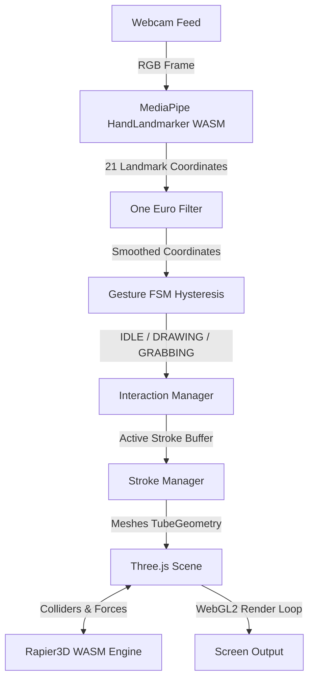

# ✋ AirCanvas 🎨

> **Turn your webcam into a 3D sketching canvas.** Draw, move, erase, and orbit around your scene in mid-air using hand gestures—all processed fully locally in your web browser.

[](https://www.typescriptlang.org/)
[](https://vitejs.dev/)
[](https://threejs.org/)
[](https://ai.google.dev/edge/mediapipe/solutions/guide)
[](https://rapier.rs/)
[](https://github.com/harshvangar2702-debug/Air-Canvas)

---

## 🌟 Overview

**AirCanvas** is a modern, web-based spatial drawing application that lets you sketch 3D lines directly in the air. By combining client-side computer vision with a real-time WebGL rendering engine and WASM-based physics, it brings spatial computing to standard laptops without requiring specialized AR/VR hardware.

---

## 🚀 Key Features

*   ✋ **Gesture-Driven Interaction**: Hysteresis-controlled State Machine classifies drawings, grabs (moving strokes), and open palm actions with no flicker.
*   📐 **Shape Snapping Engine**: Draw perfect 3D geometry mid-air—supports Freeform, Line, Rectangle, Square, Circle, Ellipse, Triangle, and Arrow.
*   🖋️ **Premium Pen Styles**: Switch between **Solid**, **Glow** (neon light effect), **Marker** (translucent highlighter), **Calligraphy** (pressure-tapered), and **Dashed** brush strokes.
*   ⚡ **WASM Physics (Rapier3D)**: Toggle gravity to watch your strokes fall, bounce, and collide with each other, with a "Reset" feature to snap them back to their original drawn locations.
*   🎮 **Dampened Orbit Controls**: Inspect your creations from any angle by switching to Orbit mode via hotkey or gesture.
*   💾 **GLTF Export**: Download your spatial creations instantly for importing into Blender, Unity, or other 3D software.
*   🔒 **Privacy First**: All video processing, hand landmarker estimation, and physics happen entirely inside your browser. No webcam feed or landmark data is ever uploaded.

---

## 🛠️ Architecture Pipeline

AirCanvas uses a decoupled, event-driven pipeline to map 2D video coordinates into a smooth, 3D interactive space:



---

## 🎮 Controls & Gesture Guide

To start drawing, position your hand comfortably in front of your webcam, facing your palm towards the camera.

### 🎨 Draw Mode (Default)
Interact, sketch, and edit the scene.

| Gesture | Pose / Action | System Action |
| :--- | :--- | :--- |
| **Draw Stroke** | 🤏 Pinch thumb & index finger tips (keeping other fingers extended) | Draw line/shape in active space |
| **Grab / Move** | ✊ Form a fist (all four fingers curled, not pinching) | Select and translate the closest stroke |
| **Erase Stroke** | 🖐️ Hold an open palm *while the Eraser tool is active on HUD* | Erase strokes within cursor radius |
| **Undo / Redo** | ⌨️ Press `Ctrl + Z` / `Ctrl + Y` or click HUD buttons | Step backward / forward in history |
| **Orbit Switch** | ⌨️ Press `O` key | Toggle between Draw Mode & Orbit Mode |

### 🌐 Orbit Mode
Orbit, rotate, and zoom around the scene to view your drawing in full 3D space.

| Gesture | Pose / Action | System Action |
| :--- | :--- | :--- |
| **One-Hand Rotate** | 🖐️ Move one open palm in any direction | Rotate/orbit the view (like spinning a globe) |
| **Two-Hand Zoom** | 🤏 Pinch both hands & spread apart / bring together | Zoom in (spread) or Zoom out (contract) |
| **Two-Hand Rotate** | 🤏 Pinch both hands & twist them rotationally | Roll/twist the view azimuthally |
| **Mouse Navigation** | 🖱️ Left click + Drag or Scroll Wheel | Orbit and zoom the camera using standard controls |

---

## ⚡ Technical Highlights & Anti-Jitter

To make mid-air webcam interaction feel precise and lag-free, AirCanvas implements several robust algorithms:
*   **One Euro Filter**: Filters high-frequency camera noise while maintaining low latency during rapid hand movements.
*   **Double-Threshold Hysteresis**: Gestures enter at tighter thresholds (e.g., `pinchEnter: 0.35`) and exit at looser thresholds (e.g., `pinchExit: 0.50`) to prevent flicker near trigger zones.
*   **Hand-Loss Grace Period**: If tracking drops briefly due to motion blur (up to 10 frames), the drawing state freezes instead of terminating. The stroke resumes seamlessly once tracking returns.
*   **Grab-Release Grace Period**: Tolerates momentary hand-shape misclassifications (up to 6 frames) while translating objects so fast movements don't cause accidental drops.

---

## 💻 Getting Started

### Prerequisites
*   **Node.js**: Version 18.0 or higher.
*   **Web Browser**: Chrome, Edge, or any modern Chromium-based browser with WebGL2 support.
*   **Hardware**: A standard webcam.

### Installation

1.  Clone the repository:
    ```bash
    git clone https://github.com/harshvangar2702-debug/Air-Canvas.git
    cd Air-Canvas
    ```

2.  Install dependencies:
    ```bash
    npm install
    ```

3.  Run the local development server:
    ```bash
    npm run dev
    ```

4.  Open the URL shown in your terminal (usually `http://localhost:5173`) and grant webcam permission.

---

## 📁 Repository Directory Structure

```text
AirCanvas/
├── src/
│   ├── gestures/         # Gesture classification, metrics, and thresholds
│   ├── interaction/      # Grab-to-move, one-hand orbit, and two-hand zoom
│   ├── physics/          # Rapier3D engine setup and collider synchronizer
│   ├── scene/            # Three.js canvas, TubeGeometry strokes, and cameras
│   ├── ui/               # HUD control bar, error overlays, and metrics
│   ├── vision/           # MediaPipe HandLandmarker, camera, & One Euro filters
│   └── main.ts           # App lifecycle loop and coordinator
├── index.html            # Main entry point document
├── package.json          # Dependency and script definitions
├── tsconfig.json         # TypeScript compiler configurations
└── vite.config.ts        # Vite bundler configurations
```

---

## 🗺️ Roadmap & Milestones

- [x] **M0: Scaffold** — Vite + TS + Three.js baseline rendering.
- [x] **M1-M3: Hand Tracking & Metrics** — MediaPipe integrations, One Euro filtering, and gesture state triggers.
- [x] **M4-M5: 3D Sketching** — Continuous tube meshes drawing on virtual planes and camera orbit verification.
- [x] **M6-M7: Object Manipulation & Physics** — Selection, translation, and Rapier3D collision physics.
- [x] **M8: Polish HUD** — Color/brush-size selections, pen-styles, deliberate eraser modes, and GLTF export.
- [x] **M9 (Next Up): Dynamic Depth Tracking** — Experimenting with single-camera monocular depth estimation models.

---

## 🔒 Security & Privacy

AirCanvas processes all camera frames on your local CPU/GPU using compiled WASM packages. Video stream pixels never leave your machine, making the app fully offline-functional and secure.

---

## 📄 License

This project is licensed under the [MIT License](LICENSE).
